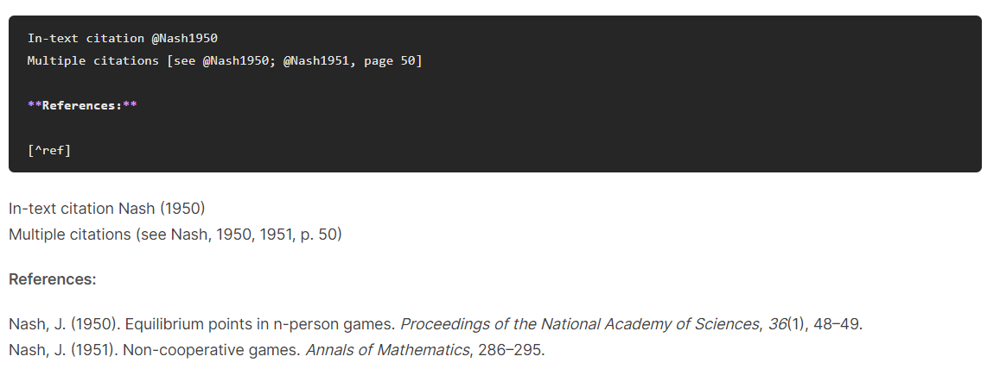

# rehype-citation



[rehype](https://github.com/wooorm/rehype) plugin to nicely format citations in markdown documents and insert bibliography in html format. It is meant to be used as a server side plugin and neatly integrates [citeproc-js](https://github.com/Juris-M/citeproc-js) and [citation-js](https://github.com/citation-js/citation-js) within the remark-rehype ecosystem.

It supports both normal citations (such as [@foo]) and in-text citation (such as @foo), as well as author-date, numerical, and note styles.

API and options follows very closely to [Rmarkdown](https://bookdown.org/yihui/rmarkdown-cookbook/bibliography.html) and [Pandoc](https://pandoc.org/MANUAL.html#citations)

**Intended for usage in Node.**
If you would like to manage citations _in the browser_, you should look into using citeproc-js directly.

## Installation

This package is [ESM only](https://gist.github.com/sindresorhus/a39789f98801d908bbc7ff3ecc99d99c):
Node 12+ is needed to use it and it must be `import`ed instead of `require`d.

```js
npm install rehype-citation
```

## Usage

Use this package [as a rehype plugin](https://github.com/rehypejs/rehype/blob/master/doc/plugins.md#using-plugins).

Some examples of how you might do that:

```js
import rehype from 'rehype'
import rehypeCitation from 'rehype-citation'

rehype().use(rehypeCitation).process(/* some html */)
```

## Sample markdown to HTML output

Input:

```md
My markdown text [@Nash1950]
```

HTML Output:

```html
<div>My markdown text (Nash, 1950)</div>
<div id="refs" class="references csl-bib-body">
  <div class="csl-entry">
    Nash, J. (1950). Equilibrium points in n-person games.
    <i>Proceedings of the National Academy of Sciences</i>, <i>36</i>(1), 48–49.
  </div>
</div>
```

## API

`rehype().use(rehypeCitation, [options])`

If no `bibliography` file is passed, the plugin will be skipped.

### options

#### options.bibliography

Type: `string`.

By default, if no `bibliography` file is passed, the plugin will be skipped.

Name of bibtex or CSL-JSON file.

#### options.path

Type: `string`.
Default: `process.cwd()`.

Required, path to file. Will be joined with `options.bibliography` and `options.csl`, if provided.

#### options.csl

Type: `'apa'|'vancouver'|'harvard1'|'chicago'|'mla'|string`.
Default: `apa`.

One of 'apa', 'vancouver', 'harvard1', 'chicago', 'mla' or name of the local csl file.

#### options.lang

Type: `string`.
Default: `en`.

Locale to use in formatting citations. Defaults to en.

#### options.suppressBibliography

Type: `boolean`.
Default: `false`.

Suppress bibliography? By default, biliography is inserted after the entire markdown file. If the file contains `[^ref]`, the biliography will be inserted there instead.

#### options.noCite

Type: `string[]`.

Citation IDs (@item1) to include in the bibliography even if they are not cited in the document.

### Limitations

1. `link-citations` is not implemented.
2. In-text citation does not parse additional locator information e.g. `@foo [p. 33]`, please use either `[@foo, p. 33]` or `@foo`.
3. Parsing of locators such as page or chapter is done by heuristics and limited to only `en` content.
4. Does not support using curly braces to protect citation key or locator information.
